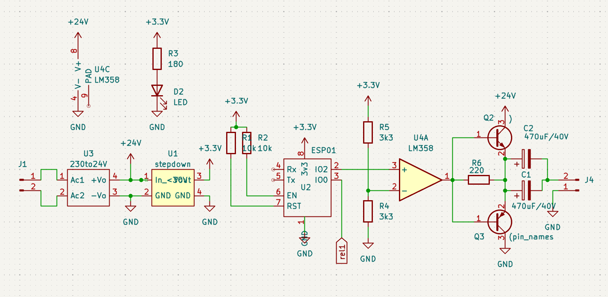

## PulseClock Master

TAGS: slaveClock slave-clock pulseclock pulse-clock secondary-clock

### So what is this

This is a NTP-clock which can drive a Pulse Clock/ secondary clock/ slave clock, the type of clock found in schools, stations or other big buildings. Nowadays most of them have been replaced by modern ones, but they still exists. These clocks are driven by a master clock which pulses the slave clocks every minute, where it moves one minute.

### Why would i need this

You might be a happy owner of such a slave clock, threw it on your attic, like me.  And always asked yourself how to enable that beautiful thing. This can be your savior. 

### What do i need

*   A slave clock obviously
*   This circuitry
*   ESP01 programmer (dont let this frighten you, its a no-brainer)
*   Wifi & internet

### The Circuit

Circuit consist of a 24V power module, 3v3 step down module, an ESP01, opamp & 2 transistor driver.

We need a 24V pulse to drive the clock. Pulses are given every minute where one pulse is positive, the next negative, this is done by the opamp, buffer transistors and the output electrolitic capacitors. The ESP01 pulses the opamp by AND-ing the lsb of the minutes every minute.
Internally time is handled by NTP so we never need to worry over adjusting except for power outages and DST change.
When you have multiple clocks, you probably get away with two or three, not tested. You could rise capacitance of the output capacitors by 2x 1000uF.

### The software

ESP01 firmware has a wifi portal, NTP, a webserver displaying time and pulse status. Time is updated through websockets to the webpage so even for this simple application there is already a lot going on. See for yourself !

### Using

Supply with mains, connect your clock, power up.
On first connection there will be no wifi credentials so the device will go into portal mode and starts is own wifi station with SSID: PulseClockMaster, connect to it (pw: 12345678) and open a page on your webbrowser. The portal page should come up. Enter your wifi credentials an press save. The device will reboot and connect, hopefully, to your wifi. From thereon you should be able to connect via http://PulseClockMaster.local but this depends on your router. If not try
http://PulseClockMaster. If that doesnt work still, find out what ip it is given by your router and connect via ip.
There is only a display of time and date, so this step is not even necessary but it will give you a good idea that it is all functioning well.

### Todo\`s

*   make settings for other timezones & DST settings, now only changeable in code
*   nicer favicon
*   automaticly handle DST changes
*   power outage handling ?

